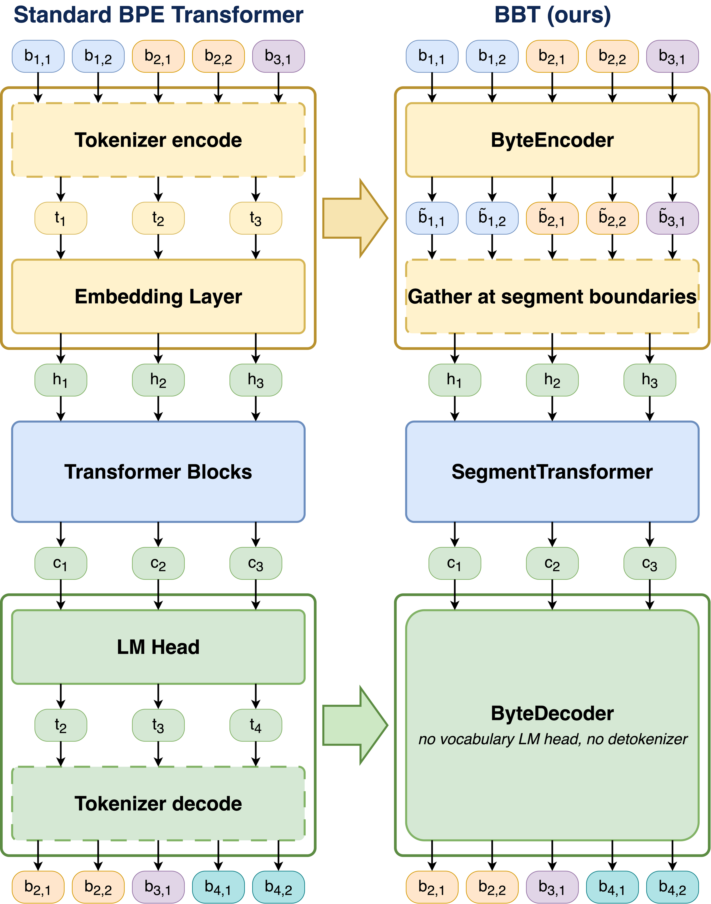

# BBT: BPE-Guided Byte Transformer

BBT preserves the sequence compression benefits of BPE segmentation while replacing vocabulary lookup and the vocabulary-sized LM head with byte-level composition.

## Paper

- [Paper (PDF)](./BBT_BPE-Guided_Byte_Transformer.pdf)
- [Poster (PDF)](./BBT_Poster.pdf)

## Overview



A standard BPE Transformer uses token IDs to index an embedding matrix and define the LM head prediction space. BBT instead composes segment representations from bytes and generates each segment byte by byte, without vocabulary-sized input and output layers.

## Key results

- Lower test bits per byte than matched standard BPE Transformers
- 20–40% fewer parameters at comparable FLOPs
- Improved robustness to character-level corruption
- Stronger transfer to unseen languages

## Citation

```bibtex
@inproceedings{kim2026bbt,
  title     = {BBT: BPE-Guided Byte Transformer},
  author    = {Kim, Hyunho and Baek, SeungYeol},
  year      = {2026}
}
```

## Authors

- Hyunho Kim — Kakao Corp
- SeungYeol Baek — AgileSoDA
